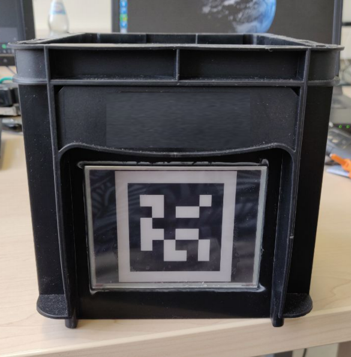

# MagicBox
This repository contains the source for the magic_box prototype as seen in the following image.
The box offers a fully basic ROS-based infrastructure to dynamically change a tag displayed on an e-inkDisplay.



### Prerequisites 

* Python 2.7 (current max Version for ROS)
* Basic installation of ROS https://www.ros.org/
* wiringPi http://wiringpi.com/
* Waveshare e-Paper https://github.com/waveshare/e-Paper
* Pillow  https://pillow.readthedocs.io/en/stable/
* Numpy

### Hardware 
For the magic box itself you will need a RaspberryPi® or a RaspberryPi-Zero®.
We used a [Waveshare](https://www.waveshare.com/) epd4in2 display and the 
[E-Paper Driver HAT](https://www.waveshare.com/wiki/E-Paper_Driver_HAT). 
If you want to use relative displays, it should be enough to change the import in pysrc/magic_box/display/EInkDisplay.py.

However, we will not provide any crafting tutorials because it should be straight forward.


## Installing (Source)
* Clone the package and install all dependencies in the
ROS-Environments of the boxs hardware and the master-system. 
* init and update submodules
```bash
    git submodule init
    git submodule update
```
   This will clone the Display sources from [Waveshare](https://github.com/waveshare/e-Paper) and the pre-generated tag families from [AprilTags](https://april.eecs.umich.edu/software/apriltag)

## Usage
Install ros on the box controller which should be a RaspberryPi® or a RaspberryPi-Zero®.
Both nodes should run on different system, but its also possible to run both on the box hardware.
The ros package primarily contains two different nodes:

* **magic_box_master**
    The magic_box_master is organizing all clients. The master 
    will provide global services to manipulate the single clients.
    The master should be launched on the ROS-Master system.
    ```bash
        roslaunch magic_box magix_box_master.launch
    ```
    
    The master offers following ROS-Service based API:     
    * **/magic_box_master/deRegisterBox** (boxName: string, baseTopic: string)
    
        Registers a new box with a unique *boxName* and the *baseTopic* the client box is registerd
        
    * **/magic_box_master/registerBox** (boxName: string) 
    
       Deregisters the box with the name given by *boxName* from the master. 
      
    * **/magic_box_master/changeID** (boxName: string, tagID: int)
    
      Changes the displayed *tagID* of the box with the *boxName* to the id given by tagID

* **magic_box_client**
    The magic_box_client controls the box (so basicly the display) itself. 
    The client should be launched on the box embedded hardware itself.
    ```bash
        roslaunch magic_box magix_box_client.launch
    ```
    
    The client offers following ROS-Service based API:     
    * **/magic_box_master/changeID** (baseTopic: string)
    
        Changes the displayed tagID of the box to the id given by *tagid*

## Needed Variables

As you can see in the client launch file ./launch/magic_box_client.launch
the boxName is a node parameter and will be automatically set with a environment
parameters called ROS_IP. This have been integrated because we wanted a automatic 
naming policy without the need of editing the launch file on each client. 
This allows for an easy distribution and you just need to clone the clients
image if you set it up once.

```xml
<launch>
  <arg name="boxname" default="box_$(env ROS_IP)"/>
    <node name="magic_box_client_$(env ROS_IP)" pkg="magic_box" type="magic_box_client" output="screen">
        <param name="boxName" type="string" value="$(arg boxname)" />
    </node>
</launch>

```
If you want to edit the name yourself just edit the launch file for the client or create a custom one. 
but if you want to use the same naming policy you need to provide the ROS_IP variable as well.
We eddited the .bashrc file and included the following line after the ros-workspace sourcing: 

```bash
    export ROS_IP=$(/sbin/ifconfig wlan0 | grep 'inet' |cut -d: -f2| awk '{ print $2}')
    export ROS_HOSTNAME=$ROS_IP  
    export ROS_MASTER_URI=http://ROS_MASTER_IP:11311
```
The script to extract the ROS_IP accesses a network module. If you do not usw wlan0 
as the targeted hardware module you have to adjust that as well.

**Don't forget to set the ROS_MASTER_IP to the IP of the ros_core master.**

## Open Source Acknowledgments
This work uses parts from:
* **Raspberry Pi®** https://www.raspberrypi.org/  
* **Robot Operation System (ROS)**  https://www.ros.org/
* **AprilTag** https://april.eecs.umich.edu/software/apriltag
* **wiringPi** http://wiringpi.com/
* **Waveshare e-Paper** https://github.com/waveshare/e-Paper
* **Pillow** https://pillow.readthedocs.io/en/stable/

**Thanks to ALL the people who contributed to the projects!**

## Authors
* [**Thomas Gulde**](https://github.com/guthom) - [*Cognitive Systems Research Group*](https://cogsys.reutlingen-university.de/) - Reutlingen-University 
* [**Vinu Vijayakumaran Nair**](https://github.com/) - [*ESB Logistics Learning Factory*](https://www.esb-business-school.de/forschung/wertschoepfungs-und-logistiksysteme/forschungsinfrastruktur/logistik-lernfabrik/) - Reutlingen-University
* [**Jan Schuhmacher**](https://github.com/janschuhmacher) - [*ESB Logistics Learning Factory*](https://www.esb-business-school.de/forschung/wertschoepfungs-und-logistiksysteme/forschungsinfrastruktur/logistik-lernfabrik/) - Reutlingen-University

## License

This project is licensed under the MIT License - see the [LICENSE](LICENSE) file for details

## Citation
This work is just indirectly involved in our research.
See other repositories for specific research projects and citations and/or cite the following papers:

```
@article{schuhmacher2019self,
  title={Self-organization of changeable intralogistics systems at the ESB Logistics Learning Factory},
  author={Schuhmacher, Jan and Hummel, Vera},
  journal={Procedia Manufacturing},
  volume={31},
  pages={194--199},
  year={2019},
  publisher={Elsevier}
}

@article{schuhmacher2017intelligent,
  title={An intelligent bin system for decentrally controlled intralogistic systems in context of Industrie 4.0},
  author={Schuhmacher, Jan and Baumung, Wjatscheslav and Hummel, Vera},
  journal={Procedia Manufacturing},
  volume={9},
  pages={135--142},
  year={2017},
  publisher={Elsevier}
}
```
